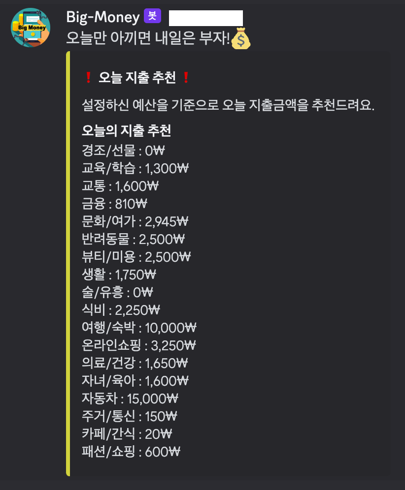
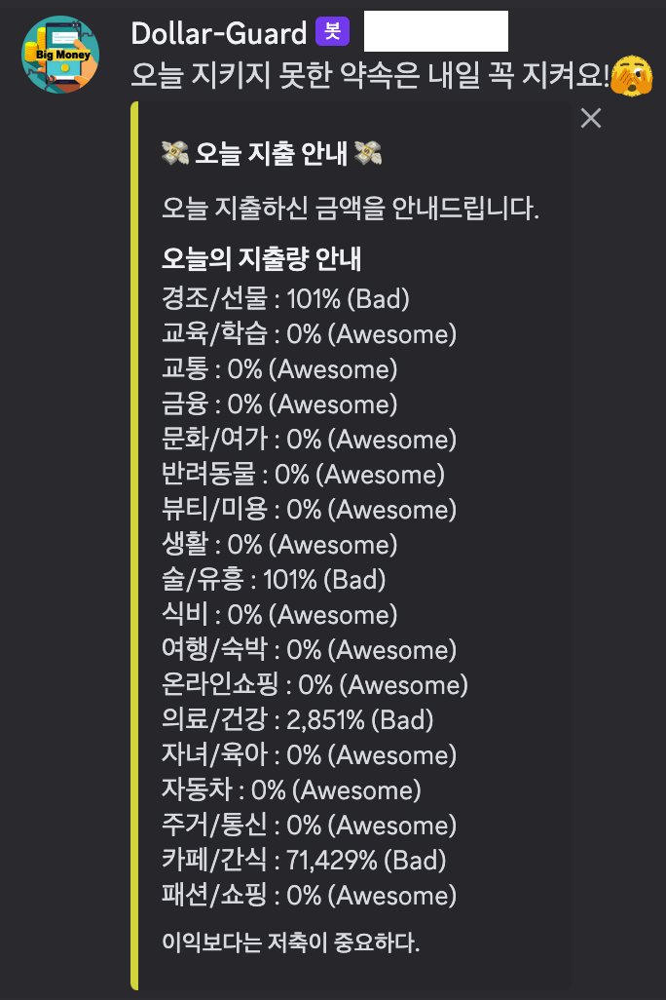
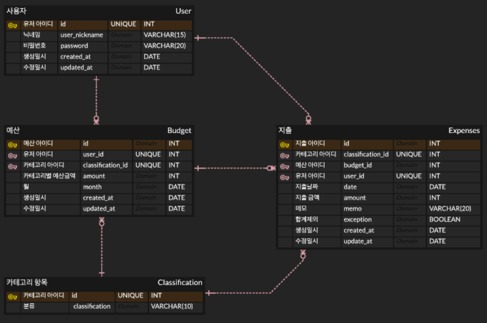
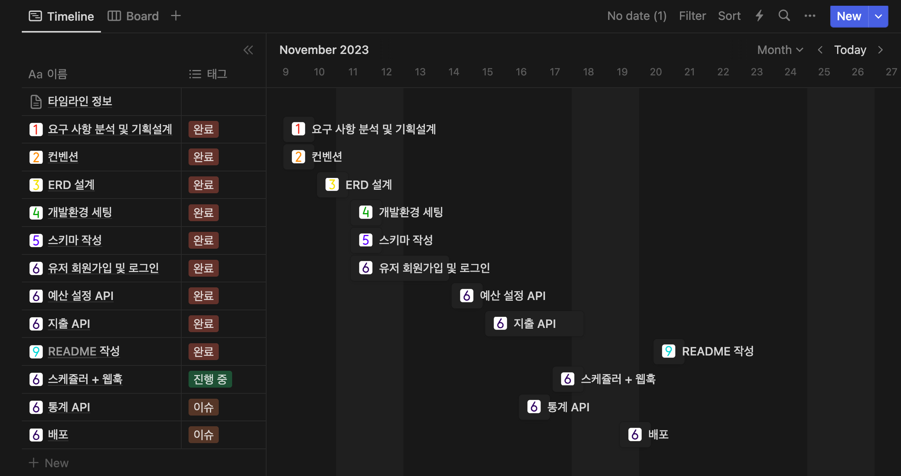

 

# 지출 관리 서비스

**개인 재무를 관리하고 지출을 추적하는 데 도움을 주는 애플리케이션입니다.**
본 서비스는 사용자들이 개인 재무를 관리하고 지출을 추적하는 데 도움을 주는 애플리케이션입니다. 이 앱은 사용자들이 예산을 설정하고 지출을 모니터링하며 재무 목표를 달성하는 데 도움이 됩니다.

<br/>

## Table of Contents

- [개요](#개요)
- [API Reference](#api-reference)
- [ERD](#ERD)
- [프로젝트 진행 및 이슈 관리](#프로젝트-진행-및-이슈-관리)
- [구현과정(설계 및 의도)](<#구현과정(설계-및-의도)>)
- [TIL 및 회고](#til-및-회고)
- [Authors](#authors)

<br/>

## 개요

현대 사회에서 개인 재무 관리는 점점 더 중요한 요소가 되고 있습니다. 그러나 많은 사람들이 여전히 이를 어려움으로 느끼며, 그 결과 자산 관리를 제대로 하지 못하고 있습니다. 이에 대한 효과적인 해결책으로 "Big-Money"를 소개드립니다.

이 애플리케이션은 사용자의 개인 재무를 관리하고 지출을 효과적으로 추적하는 데 도움을 제공합니다. 사용자는 자신의 예산을 설정하고, 지출을 모니터링하며, 재무 목표를 설정하고 달성하는 데 도움을 받을 수 있습니다.

사용자는 복잡한 재무 관리 과정을 단순화하고, 자신의 지출을 쉽게 추적하며, 자신의 재무 목표를 달성하는 데 필요한 지원을 받을 수 있습니다. 이러한 기능은 모두 사용자의 생활을 더욱 편리하고, 재무적으로 안정적인 것으로 만들어줍니다.
<br/>

## Skils

<div align="center">

언어 및 사용 도구 <br/>     
<br/>
데이터 베이스 <br/>  <br/>

</div>

## 구현과정(설계 및 의도)

### 유저 등록

- **회원가입**

  1. `계정`은 유저의 id를 기입

  2. `비밀번호`는 아래와 같은 `제약 조건`을 가지며, `암호화`하여 데이터베이스에 저장

  - 비밀번호는 최소 10자 이상
  - 숫자, 문자, 특수문자 3가지를 포함해야합니다.

- **로그인**
  1. 계정, 비밀번호로 로그인 시 JWT토큰이 발급됩니다.
  2. JWT 토큰은 `Access token`과 `Refresh token` 두개가 발급됩니다.
  - 이 떄 Refresh token은 `redis store`에 저장됩니다.
  3. 이후 게시물, 통계 API 요청 Header에 Access token가 항시 포함되며, JWT 유효성을 검증합니다.
  4. Aaccess token 만료시 Refresh token을 포함하여 재발급 요청시 Refresh 유효성 검증 후 Access토큰을 재발급합니다.

### 예산 설정

- **카테고리 금액 설정**

  1.  총 18가지의 카테고리 항목에 대한 예산금액 설정을 할 수 있습니다.
  2.  유저가 카테고리 별 예산 금액 설정을 할 수 있도록 모든 카테고리 목록을 반환합니다.

- **예산 금액 추천**
  1. 카테고리 별 예산 설정에 어려움이 있는 사용자를 위해 `예산 비율 추천 기능`이 존재합니다.
  2. 본인 제외 유저들이 설정한 카테고리 별 예산을 통계하여, 평균적으로 40% 를 식비에, 30%를 주거 에 설정 하였다면 이에 맞게 추천합니다.

### 지출 설정

- **지출 기록**

  1. - 지출을 `생성`, `수정`, `읽기(상세)`, `읽기(목록)`,`합계제외` 할 수 있습니다.
  2. `읽기(목록)` 은 아래 기능을 가지고 있습니다.
     - 필수적으로 `한달기준` 으로 조회 합니다.
     - 조회된 모든 내용의 `지출 합계` , `카테고리 별 지출 합계`, `주 카테리고 별 합계` 를 같이 반환합니다.
     - `합계제외` 처리한 지출은 목록에 포함되지만, 모든 `지출 합계`에서 제외됩니다.

- **오늘의 지출 금액 추천**

  1. 설정한 월별 예산을 만족하기 위해 오늘 지출 가능한 금액을 총액 과 카테고리 별 금액 으로 제공합니다.
  2. 지속적인 소비 습관을 위해 매일 아침 6시 webhook 알림을 보냅니다.
     

- **오늘의 지출금액 통계**
  1. 오늘 지출한 내용을 사용량(%)과 카테고리 별 지출상태를 알려줍니다.
  2. 지속적인 소비 습관을 위해 매일 오후 9시 webhook 알림을 보냅니다.
     

<br/>

<br/>

## Directory

객체지향 프로그래밍에 대한 이해도가 높아지면서 일반적인 3-layer 구조를 사용하여 진행 한 이전 프로젝트와는 다르게 **클린 아키텍처**를 적용한 이 구조는 코드의 각 부분이 어떤 역할을 하는지 명확하게 나타냅니다. 기존 프로젝트의 문제점을 설명하겠습니다. 관심사 분리 원칙을 잘 지키면서 서비스를 만들었지만, 애플리케이션의 모든 것이 영속성 계층과의 결합도가 매우 높았습니다. 혹시라도 다른 DB, 외부 라이브러리로 바꿔야 한다면 모든 코드를 수정해야하는 불편한 상황이 발생하게 됩니다. 이를 해결하기 위해 가장 고수준 추상화 모듈인 Domain layer에 나머지 layer가 의존하게 하면서 개선이 되었고 확장성과 유지보수가 용이해졌습니다. DIP부분에 집중하였습니다. 안쪽 레이어에서 바깥쪽 레이어의 구현체가 필요한 경우 인터페이스를 정의하고, 인터페이스의 구현체는 바깥쪽 레이어에 위치시켜 의존성 역전되지 않도록 하였습니다.

- Infra : 인프라스트럭쳐와 관련된 코드(예: 데이터베이스 연결 or 외부연결 서비스)
- Interface : 사용자 인터페이스와 관련된 코드
- Domain : 핵심 도메인 비즈니스 로직
- Application : 애플리케이션의 전반적인 서비스 흐름을 관리하는 코드를 포함

<details>
<summary> 파일 구조 보기 </summary>

```
📦src
 ┣ 📂auth
 ┃ ┣ 📂app
 ┃ ┣ 📂domain
 ┃ ┃ ┣ 📂dto
 ┃ ┃ ┗ 📂interfaces
 ┃ ┣ 📂infra
 ┃ ┃ ┣ 📂passport
 ┃ ┃ ┃ ┣ 📂guards
 ┃ ┃ ┃ ┗ 📂strategies
 ┃ ┗ 📂interface
 ┃ ┃ ┣ 📂dto
 ┣ 📂budget
 ┃ ┣ 📂app
 ┃ ┣ 📂domain
 ┃ ┃ ┣ 📂dto
 ┃ ┃ ┣ 📂interface
 ┃ ┣ 📂infra
 ┃ ┗ 📂interface
 ┣ 📂cache
 ┣ 📂classification
 ┃ ┣ 📂app
 ┃ ┣ 📂domain
 ┃ ┗ 📂interface
 ┣ 📂common
 ┃ ┣ 📂configs
 ┃ ┣ 📂constants
 ┃ ┣ 📂decorators
 ┃ ┣ 📂interfaces
 ┃ ┣ 📂messages
 ┃ ┃ ┣ 📂auth
 ┃ ┃ ┣ 📂budget
 ┃ ┃ ┗ 📂user
 ┃ ┣ 📂middlewares
 ┃ ┣ 📂utils
 ┣ 📂expense
 ┃ ┣ 📂app
 ┃ ┣ 📂domain
 ┃ ┃ ┣ 📂dto
 ┃ ┃ ┗ 📂interface
 ┃ ┣ 📂infra
 ┃ ┃ ┣ 📂adapter
 ┃ ┃ ┗ 📂db
 ┃ ┗ 📂interface
 ┣ 📂user
 ┃ ┣ 📂app
 ┃ ┃ ┣ 📂test
 ┃ ┣ 📂domain
 ┃ ┃ ┣ 📂dto
 ┃ ┃ ┣ 📂entity
 ┃ ┃ ┗ 📂interface
 ┃ ┣ 📂infra
 ┃ ┣ 📂interface
 ┃ ┃ ┣ 📂docs
 ┃ ┃ ┣ 📂dto
 ┃ ┃ ┣ 📂test
 ┣ 📜app.module.ts
 ┗ 📜main.ts
```

</details>
</br>

## ERD


<br/>

## 프로젝트 진행 및 이슈 관리

[프로젝트 관리 페이지](https://dev-j.notion.site/Assets-8fff434d662c4ed9b09fe4f49b46209b?pvs=4)



<br/>

## TIL 및 회고

- [save? upsert? ](https://www.notion.so/dev-j/save-upsert-2-e283914f0e9c42c6954a8a01eb4cc7bc?pvs=4)
- [Redis의 세계로](https://www.notion.so/dev-j/Redis-3f4f1fad446343178fb15091af309baa?pvs=4)
- [인증 및 인가](https://dev2-jay.tistory.com/54)
- [planToClass](https://dev-j.notion.site/planToClass-5a2c83f10768430295ed5bef885c0a88?pvs=4)

<br/>

## Authors

<div align="center">

</br>


<a href="https://github.com/J-A-Y2">정재훈</a>

</div>
<br/>
